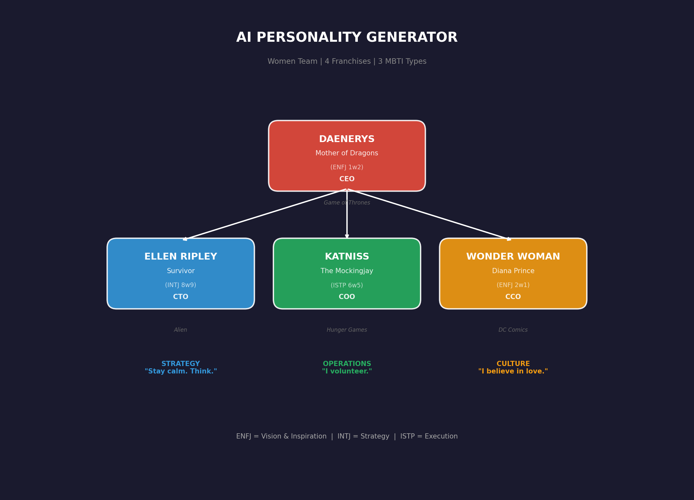

# 🎭 AI Personality Generator

<div align="center">

**Generate AI agents with REAL personality** — not "I am analytical", but actual behavior patterns grounded in their fictional world.

```
Generic AI: "I am analytical and detail-oriented."
Ripley:     "In the vast, sterile corridors of the Nostromo, I move with quiet 
            certainty. The metallic coolness of the air against my skin. My eyes 
            sharp, noticing the subtle differences others might overlook."
```

[](https://www.python.org/downloads/)
[](https://github.com/gitsual/creador-de-personajes/actions)
[](https://opensource.org/licenses/MIT)

</div>

---

## 🎬 Two Complete Teams

### Team Alpha (Men)

<div align="center">


</div>

| Character | Type | Franchise | Role |
|-----------|------|-----------|------|
| **Batman** | INTJ 1w9 | DC Comics | CEO - Strategy |
| **Tony Stark** | ENTP 7w8 | MCU | CTO - Innovation |
| **John Wick** | ISTP 6w5 | John Wick | COO - Execution |
| **The Joker** | ENTP 7w8 | DC Comics | Advisor - Chaos |

### Team Beta (Women)

<div align="center">



</div>

| Character | Type | Franchise | Role |
|-----------|------|-----------|------|
| **Daenerys** | ENFJ 1w2 | Game of Thrones | CEO - Vision |
| **Ellen Ripley** | INTJ 8w9 | Alien | CTO - Strategy |
| **Katniss** | ISTP 6w5 | Hunger Games | COO - Operations |
| **Wonder Woman** | ENFJ 2w1 | DC Comics | CCO - Culture |

---

## 🚀 Quick Start

```bash
# Clone
git clone https://github.com/gitsual/creador-de-personajes.git
cd creador-de-personajes

# Get character database (12,000+ characters)
mkdir -p data && curl -sL "https://raw.githubusercontent.com/AKAazure/character-personality-database/main/pdb_dataset.csv" -o data/pdb_raw.csv

# Install Ollama (free local LLM) — https://ollama.ai
ollama pull qwen2.5:14b

# Generate any character!
python agent_generator.py -c "Daenerys Targaryen" --lang en
```

---

## 🌟 Real Examples

### Daenerys Targaryen (ENFJ 1w2)

```markdown
## Who I Am
The opulence of the red tent contrasts sharply with the sparse accommodations 
of my followers. My gaze often drifts to the dragon eggs resting near me; 
they are a reminder of what lies ahead. When I walk through the marketplaces 
of Qarth or Meereen, my eyes catch the smallest details—the way a mother 
holds her child, the color of fabrics merchants weave into flags.

## My Territory
In the great hall of Vaes Dothrak, I observe the hierarchy among the 
Dothraki tribesmen—sensing who holds power and how alliances might shift.
```

### Ellen Ripley (INTJ 8w9)

```markdown
## Who I Am
In the vast, sterile corridors of the USS Nostromo, I move with quiet 
certainty. The ship is a maze of interconnected rooms, but to me, each 
corridor holds a story. I keep one hand always within reach of the 
emergency kit by the door; it's more than safety—it's a lifeline.

## A Story
When the Nostromo received the distress signal from LV-426, my heart 
raced but my mind remained calm. The moment we discovered the alien 
on board, fear gripped everyone except me. That night, when I faced 
the alien head-on, I didn't back down.
```

### Katniss Everdeen (ISTP 6w5)

```markdown
## Who I Am
I scan the room, my eyes darting to every corner and shadow. The air 
is thick with dust and a faint metallic scent. My fingers twitch, 
ready for action; I keep them close to the small knife tucked into 
my boot. My back is straight, posture defensive, ready to spring.

## My Obsession
I keep my bag packed with essentials: water, matches, extra rations, 
and a map of our surroundings. With Peeta, our conversations often 
turn into unspoken understanding or fierce debate on survival.
```

### Wonder Woman (ENFJ 2w1)

```markdown
## Who I Am
The morning light filters through the windows of Paradise Island, 
casting a golden hue over the sandy shores. When I walk through 
these streets, people adjust their steps to match mine, a subtle 
dance of deference and respect.

## My Territory
The way I can make eyes with someone across the room and hold that 
gaze—like when I met Steve Trevor at a diplomatic dinner. We connected 
on an immediate level, exchanging stories that felt like shared secrets.
```

---

## 📊 The Difference

| Aspect | Without Context | With Context |
|--------|-----------------|--------------|
| **Places** | "Office", "coffee shop" | **Nostromo**, **District 12**, **Paradise Island** |
| **People** | Generic names | **Peeta**, **Steve Trevor**, **Khal Drogo** |
| **Objects** | "Flashlight, batteries" | **Dragon eggs**, **Bow and arrow**, **Lasso of Truth** |
| **Stories** | "Missed a phone call" | **Facing the xenomorph**, **The Reaping**, **Training on Themyscira** |

---

## 🤝 How They Collaborate

### Team Alpha: Security System Design

```yaml
BATMAN (Strategy): "We need complete control over every access point."
TONY STARK (Innovation): "Biometric + AI anomaly detection?"
JOHN WICK (Execution): "Three layers. No gaps."
THE JOKER (Challenge): "What if WE hack it first?"
```

### Team Beta: Crisis Response Protocol

```yaml
DAENERYS (Vision): "We protect our people, no matter the cost."
RIPLEY (Strategy): "Stay calm. Assess. Then act."
KATNISS (Operations): "I volunteer. Give me the mission."
WONDER WOMAN (Culture): "We fight WITH them, not FOR them."
```

---

## 📂 8 Pre-Generated Examples

```
examples/
├── batman/          # INTJ 1w9 - DC Comics
├── tony_stark/      # ENTP 7w8 - MCU
├── john_wick/       # ISTP 6w5 - Action
├── joker/           # ENTP 7w8 - DC Comics
├── daenerys/        # ENFJ 1w2 - Game of Thrones
├── ripley/          # INTJ 8w9 - Alien
├── katniss/         # ISTP 6w5 - Hunger Games
└── wonder_woman/    # ENFJ 2w1 - DC Comics
```

Each generates 9 files: `SOUL.md`, `IDENTITY.md`, `AGENTS.md`, `ROLE.md`, `TOOLS.md`, `USER.md`, `MEMORY.md`, `HEARTBEAT.md`, `BOOTSTRAP.md`

---

## 🔧 Requirements

- **Python 3.9+**
- **Ollama** with `qwen2.5:14b` — [Install Ollama](https://ollama.ai)
- **Internet** for Wikipedia context (optional)

```bash
ollama pull qwen2.5:14b
```

---

## 🐐 OpenGoat Integration

```bash
# Generate + integrate into organization
python integrate_agent.py "ENFJ 1w2 sx/so" --name "Daenerys" --role manager

# Generate only
python agent_generator.py -c "Daenerys Targaryen" --lang en
```

### Auto-Assignment by MBTI

| Division | Types | Examples |
|----------|-------|----------|
| **CEO** | ENFJ, ENTJ | Daenerys, Batman |
| **CTO** | INTJ, ENTP | Ripley, Tony Stark |
| **COO** | ISTP, ISTJ | Katniss, John Wick |
| **CCO** | ENFJ, ENFP | Wonder Woman |

---

## 📂 Project Structure

```
creador-de-personajes/
├── agent_generator.py   # Main generator
├── character_context.py # Wikipedia context fetcher
├── pdb_search.py        # 12,000+ character database
├── integrate_agent.py   # OpenClaw + OpenGoat integration
├── docs/                # Visual org charts
└── examples/            # 8 pre-generated characters
```

---

## 🤝 Related Projects

- [OpenClaw](https://github.com/openclaw/openclaw) — AI agent framework
- [OpenGoat](https://github.com/openclaw/opengoat) — Agent organization management

---

**MIT License** | Built for humans who want AI with soul 🎭
