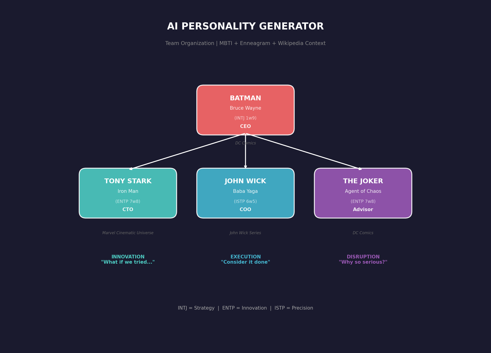
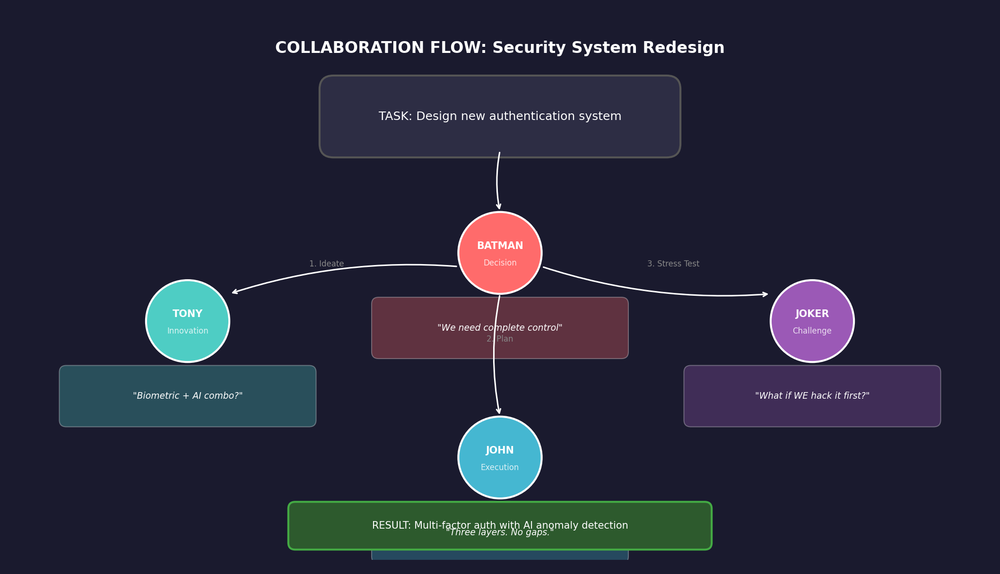

# 🎭 AI Personality Generator

<div align="center">

**Generate AI agents with REAL personality** — not "I am analytical", but actual behavior patterns grounded in their fictional world.

```
Generic AI: "I am analytical and detail-oriented. I check locks before leaving."
Batman:     "Gotham's shadows stretch long. My eyes pick out minute details—a scuff 
            mark near an alley, a shadow flicker in a window. Alfred's presence 
            comforting without ever intruding."
```

[](https://www.python.org/downloads/)
[](https://github.com/gitsual/creador-de-personajes/actions)
[](https://opensource.org/licenses/MIT)

</div>

---

## 🎬 See It In Action

| What You Say | What You Get |
|--------------|--------------|
| `python agent_generator.py -c "Batman"` | INTJ 1w9 — Gotham, Alfred, Wayne Manor, Crime Alley |
| `python agent_generator.py -c "Tony Stark"` | ENTP 7w8 — Stark Industries, Pepper, Rhodey, Iron Man suits |
| `python agent_generator.py -c "John Wick"` | ISTP 6w5 — The Continental, Baba Yaga, precision execution |
| `python agent_generator.py -c "Joker"` | ENTP 7w8 — Arkham Asylum, Harley Quinn, chaos philosophy |

**New in V10:** Automatically fetches character context from Wikipedia to ground personalities in their actual fictional universe!

---

## 🐐 Team Organization

<div align="center">



</div>

**4 iconic characters from 3 different franchises:**

| Character | Type | Franchise | Role | Strength |
|-----------|------|-----------|------|----------|
| **Batman** | INTJ 1w9 | DC Comics | CEO | Strategy, control, long-term vision |
| **Tony Stark** | ENTP 7w8 | MCU | CTO | Innovation, rapid prototyping |
| **John Wick** | ISTP 6w5 | Action | COO | Precision execution, reliability |
| **The Joker** | ENTP 7w8 | DC Comics | Advisor | Chaos, stress-testing, lateral thinking |

---

## 🤝 How They Collaborate

<div align="center">



</div>

### Task Example: Security System Redesign

```yaml
BATMAN (CEO - Decision):
  "We need complete control over every access point."
  → Sets requirements, approves final design

TONY STARK (CTO - Innovation):
  "What if we combined biometrics with AI anomaly detection?"
  → Proposes creative solutions, builds prototypes

JOHN WICK (COO - Execution):  
  "Three layers. No gaps. Consider it done."
  → Implements with precision, ensures reliability

THE JOKER (Advisor - Challenge):
  "What if WE tried to hack it first?"
  → Stress-tests assumptions, finds vulnerabilities
```

**Result:** Multi-factor auth with AI anomaly detection, penetration-tested by chaos.

---

## 📊 The Difference

| Aspect | Without Context | With Context (V10) |
|--------|-----------------|-------------------|
| **Places** | "Office", "coffee shop" | **Gotham**, **Stark Tower**, **Arkham Asylum** |
| **People** | Generic names (Sarah, Alex) | **Alfred**, **Pepper Potts**, **Harley Quinn** |
| **Objects** | "Flashlight, batteries" | **Batsuit**, **Iron Man suit**, **pencil** |
| **Stories** | "Missed a phone call" | **Parents' murder**, **father's funeral**, **escape from Arkham** |
| **Voice** | "I am analytical" | *"I am the night"* / *"Why so serious?"* |

---

## 🚀 Quick Start

```bash
# 1. Clone
git clone https://github.com/gitsual/creador-de-personajes.git
cd creador-de-personajes

# 2. Get character database (12,000+ characters)
mkdir -p data && curl -sL "https://raw.githubusercontent.com/AKAazure/character-personality-database/main/pdb_dataset.csv" -o data/pdb_raw.csv

# 3. Install Ollama (free local LLM)
# See: https://ollama.ai — then: ollama pull qwen2.5:14b

# 4. Generate!
python agent_generator.py -c "Batman" --lang en
```

**Output:** 9 personality files ready to use (SOUL.md, IDENTITY.md, etc.)

---

## 🌟 Real Examples

### Batman (INTJ 1w9 so/sp)

```markdown
## Who I Am
Gotham's shadows stretch long, casting sharp angles on the streets. 
My eyes pick out minute details: a scuff mark near an alley mouth, 
a shadow flicker in a window across the way. The air carries a cold 
dampness, and I can taste the gritty residue of street grime.

## My Territory
I meticulously observe the intricate web of Gotham's power dynamics. 
At Wayne Enterprises board meetings, I dissect every word and gesture 
like a chess master analyzing moves several turns ahead.

## A Story
The night after my parents' murder, the cold seeped into my bones as 
I hid behind bushes near Crime Alley. The sound of sirens grew louder 
but never close enough. This moment is what fuels my relentless pursuit 
of justice and order.
```

### The Joker (ENTP 7w8 sx/so)

```markdown
## Who I Am
I'm always on the move, feeling restless in this gloomy Gotham. My eyes 
dart around the room, naturally settling at any door or exit. There's a 
certain texture to the floor tiles of Arkham Asylum, each one worn down 
by countless footsteps, telling stories only I can decipher.

## My Voice
1. "Oh boy, we're gonna have some fun."
2. "Let's twist this around and see how it fits."
3. "Why so serious?"

## My Obsession
I seek deep connections that are intense and immediate. When plotting 
against Batman, I make sure he knows exactly what game we're playing.
```

### Tony Stark (ENTP 7w8 sx/sp)

```markdown
## Who I Am
I stand by the window of my penthouse, looking out at the city skyline 
through an intricate web of reflective glass. My hand traces the ridges 
of the metal frame as my eyes dart from the latest Stark Industries 
project to the small, framed photo of my parents.

## My Obsession
I'm drawn to people who can light up my brain as brightly as an idea does. 
A glance at Pepper, and her eyes become windows to the soul; a conversation 
with Rhodey turns into a deep dive into our shared past.
```

### John Wick (ISTP 6w5 sp/sx)

```markdown
## Who I Am
The weight of my pistol feels like a familiar second skin, its grip so 
well-worn that it molds to the shape of my palm. My eyes dart around 
the room, assessing angles and possible exits before settling on the 
subtle play of light across the wooden floorboards.

## A Story
The moment I received news that my dog was gone—the final message from 
the hitman—my world narrowed to a single task: find her killer. The scent 
of wet pavement mingled with the faint smell of leather. Following this 
path led me to a confrontation where I ended the life that had taken mine.
```

---

## 🧠 How It Works

**Three psychology frameworks + Wikipedia context:**

| Layer | What It Does | Example |
|-------|--------------|---------|
| **MBTI** | How they think | INTJ = strategic, long-term planning |
| **Enneagram** | What drives them | 1w9 = perfectionism + peace-seeking |
| **Instincts** | Where they focus | so/sp = group status + self-preservation |
| **Context** | Ground in reality | DC Comics universe, Gotham, Alfred |

**Result:** Batman doesn't check "door locks" — he checks **Gotham's power dynamics**.

---

## 🐐 OpenGoat Integration

### Automatic Role Assignment by MBTI

```bash
# Generate + integrate into OpenGoat organization
python integrate_agent.py "INTJ 1w9 so/sp" --name "Batman" --role manager --lang en
```

| Division | MBTI Types | Characters |
|----------|------------|------------|
| **CEO** (Vision) | INTJ, ENTJ | Batman |
| **CTO** (Innovation) | ENTP, INTP | Tony Stark, Joker |
| **COO** (Execution) | ISTP, ISTJ | John Wick |

### Why This Team Works

| Pair | Dynamic | Use Case |
|------|---------|----------|
| **Batman + Tony** | Strategy × Innovation | Architecture decisions |
| **Batman + Joker** | Order × Chaos | Stress-testing plans |
| **Tony + John** | Ideas × Execution | Rapid deployment |
| **John + Joker** | Precision × Disruption | Edge case handling |

### Commands

```bash
# Full integration: generate + OpenClaw + OpenGoat
python integrate_agent.py "INTJ 1w9 so/sp" --name "Batman" --role manager

# Generate only (no integration)
python agent_generator.py -c "Batman" --lang en

# Delete agent from all systems
python integrate_agent.py --delete "Batman"
```

---

## 📂 Generated Files

Each character generates 9 files:

| File | Purpose |
|------|---------|
| `SOUL.md` | Deep personality (2500+ words) — the core |
| `IDENTITY.md` | Quick reference card |
| `AGENTS.md` | Behavioral rules |
| `ROLE.md` | Organizational role |
| `TOOLS.md` | Tool configurations |
| `USER.md` | User context template |
| `MEMORY.md` | Persistent memory |
| `HEARTBEAT.md` | Periodic tasks |
| `BOOTSTRAP.md` | First-run setup |

---

## 🔧 Requirements

- **Python 3.9+** (uses modern type hints)
- **Ollama** with `qwen2.5:14b` — [Install Ollama](https://ollama.ai) (free, runs locally)
- **Internet** for Wikipedia context (optional — works without, just less specific)

```bash
# Verify Ollama is running
ollama list

# Get the model (~9GB)
ollama pull qwen2.5:14b
```

**System requirements:**
- **RAM:** 16GB+ recommended
- **VRAM:** 12GB+ for GPU acceleration
- **Disk:** ~10GB for model

---

## 🌍 Languages

```bash
# English
python agent_generator.py -c "Batman" --lang en

# Spanish (default)
python agent_generator.py -c "Batman" --lang es
```

---

## 📂 Project Structure

```
creador-de-personajes/
├── agent_generator.py   # Main generator
├── character_context.py # Wikipedia context fetcher
├── pdb_search.py        # Character database search
├── integrate_agent.py   # OpenClaw + OpenGoat integration
├── data/                # PDB dataset (12,000+ characters)
├── docs/                # Images and documentation
│   ├── orgchart.png     # Team organization chart
│   └── collaboration.png # Collaboration flow example
├── examples/            # Pre-generated examples
│   ├── batman/
│   ├── tony_stark/
│   ├── john_wick/
│   └── joker/
└── tests/               # 29 tests passing
```

---

## ❓ FAQ

<details>
<summary><b>What if Wikipedia doesn't have my character?</b></summary>

The generator still works — it just uses typology alone. For best results, use well-known characters from movies, TV, books, or games.
</details>

<details>
<summary><b>Can I use GPT-4/Claude instead of Ollama?</b></summary>

Modify `call_ollama()` in `agent_generator.py` to call your preferred API. The prompt structure remains the same.
</details>

<details>
<summary><b>Does it work offline?</b></summary>

**Partially.** Generation works offline once you have the model, but Wikipedia context requires internet.
</details>

---

## 🤝 Related Projects

- [OpenClaw](https://github.com/openclaw/openclaw) — AI agent framework
- [OpenGoat](https://github.com/openclaw/opengoat) — Agent organization management
- [Personality Database](https://www.personality-database.com) — Character typology source

---

## 📚 Theory

Based on established typology systems:
- **MBTI**: C.S. Joseph's cognitive function interpretation
- **Enneagram**: Riso-Hudson tradition with instinctual variants
- **Instincts**: Beatrice Chestnut's somatic approach

> **Note:** These are personality frameworks for creative characterization, not scientifically validated psychological assessments.

---

**MIT License** | Built for humans who want AI with soul 🎭
