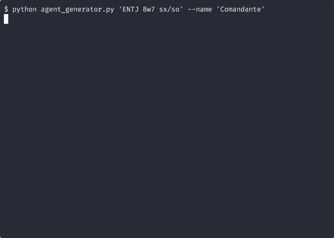

# 🎭 OpenClaw Agent Generator

<div align="center">

### **From robots to people.** One command.

[](https://github.com/openclaw/openclaw)
[](https://github.com/openclaw/opengoat)
[](https://www.python.org/downloads/)
[](https://opensource.org/licenses/MIT)

**Generate AI agents with real psychological depth** using MBTI × Enneagram × Instincts

<br/>



<br/>

</div>

---

## 💡 The Problem

You've seen it: AI agents that feel like **robots with fancy prompts**. They respond, but they don't *behave*. They have no consistency, no character arc, no reason to act one way vs another.

**This tool changes that.**

Using three validated psychology frameworks (MBTI cognitive functions, Enneagram passions, and Instinctual variants), this generator creates agents that:

- **React consistently** — An ENTJ 8w7 *pushes*, an INFP 4w5 *reflects*
- **Show, don't tell** — No "I am analytical", just analytical behavior
- **Have real boundaries** — With *consequences*, not warnings
- **Feel physical sensations** — Fear makes hands tremble, anger tightens the chest

> *"It's like Disco Elysium's skill system, but for your AI workforce."*

### 📊 See The Difference

**[→ Full comparison: Generic vs Personality agents](docs/COMPARISON.md)**

| Code Review | Generic Agent | Dr. House (INTP 5w4) |
|-------------|--------------|----------------------|
| **Content** | "SQL injection vulnerability..." | "Oh look, a SQL injection waiting to happen. Did you copy this from a 2003 tutorial?" |
| **Impact** | Forgettable | **Memorable** |
| **Behavior change** | Unlikely | **Shame is a powerful teacher** |

### ⚡ For OpenClaw Users

| Feature | What You Get |
|---------|-------------|
| 🚀 **One command** | Deploy to `~/.openclaw/agents/` instantly |
| 📝 **9 files generated** | SOUL.md, IDENTITY.md, AGENTS.md, TOOLS.md, etc. |
| 🎯 **No meta-bullshit** | Agents SHOW personality, not "I am an ENTJ" |
| 🧠 **4 mental states** | Ego → Shadow → Subconscious → Superego |
| 🌍 **i18n ready** | `--lang en` / `--lang es` |

### 🏢 For OpenGoat Organizations

| Feature | What You Get |
|---------|-------------|
| 📊 **Auto-hierarchy** | Assigns managers by psychological fit |
| 🏷️ **Smart tagging** | Division (CTO/COO/CCO) + MBTI labels |
| 🔗 **Instant integration** | Creates `config.json`, ready to go |
| 🧩 **Cross-platform** | Linux, macOS, Windows paths auto-detected |

## Quick Start

```bash
# Clone
git clone https://github.com/gitsual/creador-de-personajes.git
cd creador-de-personajes

# Download PDB dataset (12k+ characters)
mkdir -p data && curl -sL "https://raw.githubusercontent.com/AKAazure/character-personality-database/main/pdb_dataset.csv" -o data/pdb_raw.csv

# 🔥 Generate from character name (searches Personality Database)
python agent_generator.py --character "Tony Stark" --lang en
python agent_generator.py -c "Walter White" --name Heisenberg
python agent_generator.py -c "Gregory House" --name House --lang en

# Or use typology directly
python agent_generator.py "ENTJ 8w7 sx/so" --name Commander --lang en

# Full pipeline: Generate → OpenClaw → OpenGoat
python integrate_agent.py "ISFP 6w5 sp/sx" --name "Artist"
```

### 🔍 Search Personality Database

```bash
# Interactive search
python pdb_search.py -i

# Search and show results
python pdb_search.py "Sherlock Holmes"

# Get typology string only (for scripting)
python pdb_search.py -t "Tony Stark"
# Output: ENTP 7w8 sx/sp

# Database stats
python pdb_search.py --stats
```

## 🌟 Build Your Dream Team

**Find any character on [Personality Database](https://www.personality-database.com). Get their typology. Run one command.**

| Character | Typology | Command | Use Case |
|-----------|----------|---------|----------|
| **Tony Stark** | ENTP 7w8 sx/so | `"ENTP 7w8 sx/so"` | Innovation, rapid prototyping |
| **Walter White** | INTJ 5w6 sp/sx | `"INTJ 5w6 sp/sx"` | Cold strategy, planning |
| **L (Death Note)** | INTP 5w4 sp/sx | `"INTP 5w4 sp/sx"` | Pattern detection, debugging |
| **Sherlock Holmes** | INTP 5w6 sp/sx | `"INTP 5w6 sp/sx"` | Deduction, investigation |
| **Elon Musk** | INTJ 5w6 sp/so | `"INTJ 5w6 sp/so"` | Long-term vision, systems |
| **Rick Sanchez** | ENTP 7w8 sx/sp | `"ENTP 7w8 sx/sp"` | Mad science, no limits |
| **Levi Ackerman** | ISTP 6w5 sp/sx | `"ISTP 6w5 sp/sx"` | Tactical execution |
| **Light Yagami** | INTJ 3w4 so/sp | `"INTJ 3w4 so/sp"` | Strategic manipulation |

```bash
# Make Tony Stark code for you
python agent_generator.py "ENTP 7w8 sx/so" --name "Stark" --lang en

# L as your debugging assistant  
python agent_generator.py "INTP 5w4 sp/sx" --name "L" --lang en

# Walter White for ruthless strategy
python agent_generator.py "INTJ 5w6 sp/sx" --name "Heisenberg" --lang en
```

### 🤝 Real Chemistry, Not Random Coordination

Here's what most multi-agent systems miss: **agents don't just need tasks—they need compatible dynamics.**

If you know two friends who work brilliantly together, type them correctly, and their AI versions will collaborate the same way.

| Pair | Why It Works | Dynamics |
|------|--------------|----------|
| **ENTP + INTJ** | Tony Stark + Bruce Wayne | Innovation meets strategy |
| **ENTJ + INTP** | Commander + Analyst | Execution meets depth |
| **ENFJ + ISFP** | Leader + Artist | Vision meets craft |
| **ESTP + ISTJ** | Maverick + Guardian | Action meets precision |

**This isn't arbitrary robot coordination.** It's psychology-backed team chemistry you've already seen work in real life—now applied to AI.

> **Coming soon:** Share agents. Download pre-made personalities. Compatibility matrices. Personality marketplaces.

---

## 🌍 Internationalization

The generator supports multiple languages via the `--lang` flag:

| Flag | Language | Description |
|------|----------|-------------|
| `--lang es` | Spanish | Default. All output in Spanish |
| `--lang en` | English | All output in English |

```bash
# Spanish (default)
python agent_generator.py "INFP 4w5 sp/sx" --name "Poeta"

# English
python agent_generator.py "INFP 4w5 sp/sx" --name "Poet" --lang en
```

All generated files (SOUL.md, IDENTITY.md, AGENTS.md, etc.) will be in the specified language.

## What Gets Generated

### OpenClaw Agent (`~/.openclaw/agents/<name>/`)

```
~/.openclaw/agents/artist/
├── SOUL.md          # Deep personality (2500+ words)
├── IDENTITY.md      # Quick reference card
├── AGENTS.md        # Behavioral rules
├── TOOLS.md         # Tool configurations
├── USER.md          # User context
├── MEMORY.md        # Persistent memory
├── HEARTBEAT.md     # Periodic tasks
├── BOOTSTRAP.md     # First-run setup
└── ROLE.md          # Organizational role
```

### OpenGoat Registration (`~/.opengoat/agents/<name>/`)

```json
{
  "id": "artist",
  "displayName": "Artist", 
  "organization": {
    "type": "individual",
    "reportsTo": "cco_lead",
    "discoverable": true,
    "tags": ["cco", "isfp"]
  },
  "runtime": {
    "provider": { "id": "openclaw" },
    "mode": "organization"
  }
}
```

## Typology System

### Syntax

```
"MBTI Xw# inst/inst"
 │     │    │
 │     │    └── Instinctual stack (sp/sx, so/sp, sx/so, etc.)
 │     └─────── Enneagram type + wing (8w7, 4w5, 6w5, etc.)
 └───────────── MBTI type (ENTJ, ISFP, INTP, etc.)
```

### Examples for OpenClaw Agents

| Command | Agent Personality | Best For |
|---------|-------------------|----------|
| `"ENTJ 8w7 sx/so"` | Dominant commander, intensity-seeking | Leadership, decisions |
| `"INTP 5w4 sp/sx"` | Analytical hermit, deep focus | Research, debugging |
| `"ENFJ 2w3 so/sx"` | Charismatic helper, people-focused | User support, onboarding |
| `"ISTJ 1w2 sp/so"` | Precise guardian, detail-oriented | Documentation, QA |
| `"ENTP 7w8 sx/so"` | Provocative innovator, idea machine | Brainstorming, exploration |

## OpenGoat Organization Structure

Agents auto-assign to managers based on psychological fit:

```
                         ┌─────────┐
                         │   CEO   │
                         │  (CEO)  │
                         └────┬────┘
                              │
        ┌─────────────────────┼─────────────────────┐
        │                     │                     │
   ┌────┴────┐           ┌────┴────┐           ┌────┴────┐
   │   COO   │           │   CTO   │           │   CCO   │
   │ (COO) │           │(CTO) │           │(CCO) │
   │  Ops    │           │Strategy │           │ Culture │
   └────┬────┘           └────┬────┘           └────┬────┘
        │                     │                     │
   ┌────┴────┐           ┌────┴────┐           ┌────┴────┐
   │ ENTJ    │           │ INTJ    │           │ ENFJ    │
   │ ESTJ    │           │ INTP    │           │ INFJ    │
   │ ISTJ    │           │ ENTP    │           │ xSFx    │
   │ xSTP    │           │         │           │ xNFP    │
   └─────────┘           └─────────┘           └─────────┘
```

| MBTI | Division | Manager | Rationale |
|------|----------|---------|-----------|
| INTJ, INTP | CTO | cto_lead | Strategic thinkers |
| ENTP | CTO | tech_innovator | Innovation + debate |
| ESTJ, ISTJ, xSTP | COO | coo_lead | Execution focus |
| ENTJ | COO | ops_commander | Operational leadership |
| ENFP | CCO | culture_catalyst | Creative culture |
| ISFP, ESFP | CCO | creative_artisan | Aesthetic + hands-on |
| Other xNFx, xSFx | CCO | cco_lead | People-oriented |

## Generated SOUL.md Example

Here's what a generated OpenClaw agent looks like:

```markdown
# SOUL.md - Artist

## Who I Am

I walk the mountain path with a full backpack—water, supplies, charger. 
Just in case. My eyes scan for danger before I notice the rough bark 
texture against my palm. When safe, I stop for precisely-made coffee, 
savoring spiced aroma in fresh morning air. My posture stays tense, 
vigilant. Always alert.

## My Voice

- "Do you see that man? He looks suspicious."
- "This doesn't sit right with me."
- "Thank you for listening. You're valuable to me."
- "This is ridiculous! How could you think that?"
- "I just need everything under control."

## What Drives Me

### The Fire
When fear grips me, hands tremble, breathing accelerates. Heart pounds 
while cold sweat runs down my back. Muscles tense for fight or flight.

### My Obsession  
I check locks before bed. Every night. Bag ready by the door—water, 
money, charger. No one enters my space uninvited.

## When Someone Fails Me

My coworker left a critical task unfinished. I told him directly to 
his face what I thought, then implemented a protocol ensuring it 
never happens again.
```

## Architecture

```
┌─────────────────────────────────────────────────────────────────┐
│                    OPENCLAW AGENT GENERATOR                     │
├─────────────────────────────────────────────────────────────────┤
│                                                                 │
│  ┌─────────────┐  ┌─────────────┐  ┌─────────────┐             │
│  │    MBTI     │  │  ENNEAGRAM  │  │  INSTINCTS  │             │
│  │             │  │             │  │             │             │
│  │ • 4 Sides   │  │ • 9 Types   │  │ • sp: Body  │             │
│  │ • 8 Funcs   │  │ • 18 Wings  │  │ • so: Group │             │
│  │ • Ego/Shadow│  │ • Passions  │  │ • sx: Bond  │             │
│  └──────┬──────┘  └──────┬──────┘  └──────┬──────┘             │
│         │                │                │                     │
│         └────────────────┼────────────────┘                     │
│                          ▼                                      │
│                  ┌──────────────┐                               │
│                  │   OLLAMA     │                               │
│                  │  (Qwen 14B)  │                               │
│                  └──────┬───────┘                               │
│                         │                                       │
│         ┌───────────────┼───────────────┐                       │
│         ▼               ▼               ▼                       │
│  ┌────────────┐  ┌────────────┐  ┌────────────┐                │
│  │  OPENCLAW  │  │  OPENGOAT  │  │   LOCAL    │                │
│  │   AGENT    │  │   CONFIG   │  │   FILES    │                │
│  │            │  │            │  │            │                │
│  │ ~/.openclaw│  │ ~/.opengoat│  │ ./agents/  │                │
│  └────────────┘  └────────────┘  └────────────┘                │
│                                                                 │
└─────────────────────────────────────────────────────────────────┘
```

## The Four Sides of Mind (for OpenClaw Agents)

Each agent has four psychological states they can enter:

```
                    ENTJ Agent Example
    ┌────────────────────────────────────────┐
    │                                        │
    │   EGO (ENTJ)         SHADOW (INTP)    │
    │   "Commander"        "Paranoid"        │
    │   Normal ops         Under stress      │
    │                                        │
    │   SUBCONSCIOUS       SUPEREGO          │
    │   (ISFP)             (ESFJ)            │
    │   "Flow State"       "Inner Critic"    │
    │   Peak performance   Self-judgment     │
    │                                        │
    └────────────────────────────────────────┘
```

This means your OpenClaw agents can realistically:
- **Ego**: Handle normal tasks with characteristic style
- **Subconscious**: Enter flow states under positive conditions  
- **Shadow**: Become paranoid/reactive under stress
- **Superego**: Self-critique when standards aren't met

## Quality Validation

The generator was iteratively tested to ensure OpenClaw agents feel authentic:

| Metric | Target | Achieved |
|--------|--------|----------|
| No meta-labels ("my wing", "my instinct") | 100% | ✅ |
| Actions over descriptions | >80% | ✅ |
| Executed consequences ("I did") | >90% | ✅ |
| Physical sensations present | >85% | ✅ |
| Overall authenticity score | >7.2/10 | **7.9/10** ✅ |

## Testing

```bash
# Run unit tests (fast, no Ollama needed)
python run_tests.py --quick

# Run all tests including integration (requires Ollama)
python run_tests.py --full
```

**Test Coverage:**
- ✅ Typology parsing (MBTI, Enneagram, Instincts)
- ✅ Division/Manager assignment logic
- ✅ File generation structure
- ✅ OpenClaw integration paths
- ✅ OpenGoat config creation
- ✅ CLI interface
- ✅ Real generation with Ollama (integration)
- ✅ No meta-labels validation

## Installation

### Requirements

- Python 3.8+
- [Ollama](https://ollama.ai/) with `qwen2.5:14b`
- [OpenClaw](https://github.com/openclaw/openclaw) (for agent deployment)
- [OpenGoat](https://github.com/openclaw/opengoat) (for organization features)

### Cross-Platform Support

The generator automatically detects your operating system and uses the correct paths:

| Platform | OpenClaw Path | OpenGoat Path |
|----------|---------------|---------------|
| 🐧 Linux | `~/.openclaw/agents/` | `~/.opengoat/agents/` |
| 🍎 macOS | `~/.openclaw/agents/` | `~/.opengoat/agents/` |
| 🪟 Windows | `%APPDATA%\openclaw\agents\` | `%APPDATA%\opengoat\agents\` |

Directories are created automatically if they don't exist.

### Setup

```bash
# Clone the generator
git clone https://github.com/gitsual/creador-de-personajes.git
cd creador-de-personajes

# Ensure Ollama has the model
ollama pull qwen2.5:14b

# Test generation
python agent_generator.py "ENTP 7w8 sx/so" --name "Tester"
```

## Usage

### Generate OpenClaw Agent

```bash
# Basic generation
python agent_generator.py "ENTJ 8w7 sx/so" --name "Commander"

# Custom output directory
python agent_generator.py "INFP 4w5 sp/sx" --name "Poet" --output ./my-agents/

# Different Ollama model
python agent_generator.py "ESTJ 1w2 so/sp" --name "Director" --model qwen2.5:32b
```

### Full OpenClaw + OpenGoat Integration

```bash
# Generate and deploy everywhere
python integrate_agent.py "ISFP 6w5 sp/sx" --name "Artist"

# Use existing agent files
python integrate_agent.py "ISFP 6w5 sp/sx" --name "Artist" \
    --skip-generate --agent-dir ./agents/artist

# Register as manager (not IC)
python integrate_agent.py "ENTJ 8w7 sx/so" --name "Commander" --role manager
```

## Project Files

```
creador-de-personajes/
├── agent_generator.py    # OpenClaw agent generator
├── integrate_agent.py    # Full OpenClaw + OpenGoat pipeline
├── csj_core.py           # MBTI cognitive functions
├── cuatro_lados.py       # Four sides of mind logic
├── narrador.py           # Narrative utilities
└── README.md
```

## Related Projects

- **[OpenClaw](https://github.com/openclaw/openclaw)** - The AI agent framework this generator targets
- **[OpenGoat](https://github.com/openclaw/opengoat)** - Organization management for OpenClaw agents
- **[OpenClaw Docs](https://docs.openclaw.ai)** - Official documentation

## Theory

Based on established typology systems:
- **MBTI**: C.S. Joseph's cognitive function interpretation
- **Enneagram**: Riso-Hudson tradition with instinctual variants
- **Instincts**: Beatrice Chestnut's somatic approach

## Contributing

PRs welcome! Especially:
- Additional typology combinations
- More realistic behavioral patterns
- Better instinct integration
- OpenGoat hierarchy refinements

## License

MIT

---

**Built for the [OpenClaw](https://github.com/openclaw/openclaw) ecosystem** 🦞

*Inspired by Disco Elysium's skill system and C.S. Joseph's Type Grid.*
