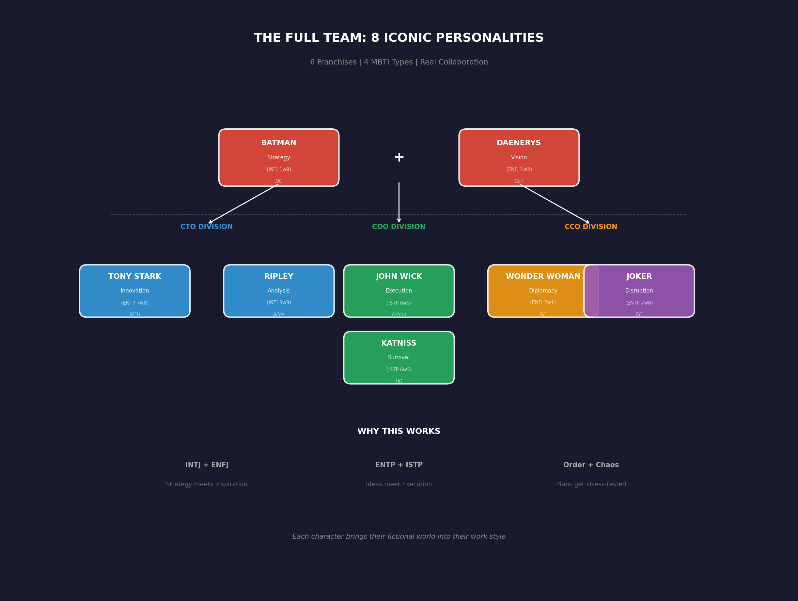
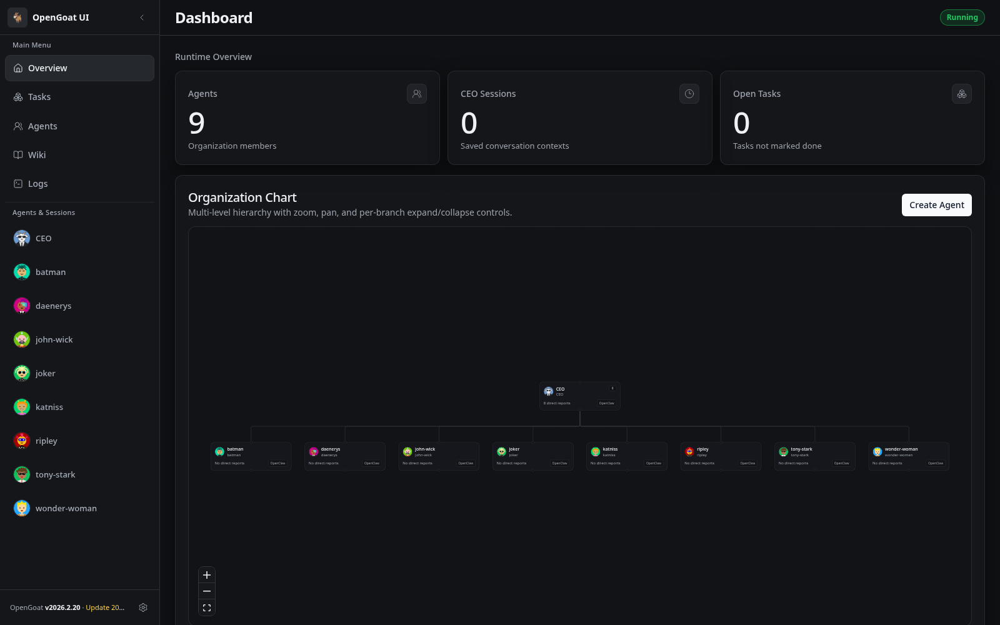
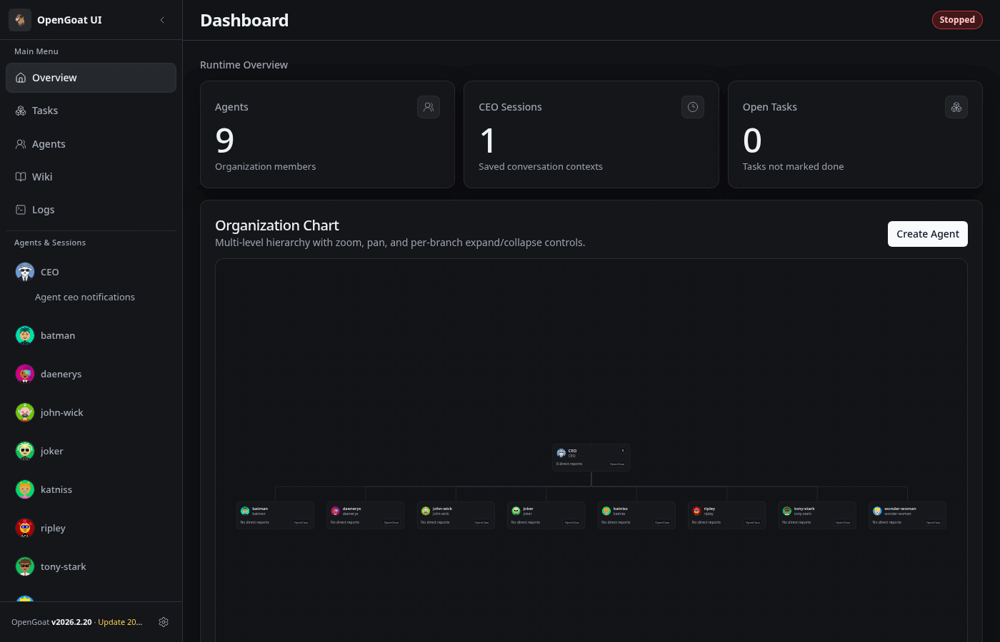
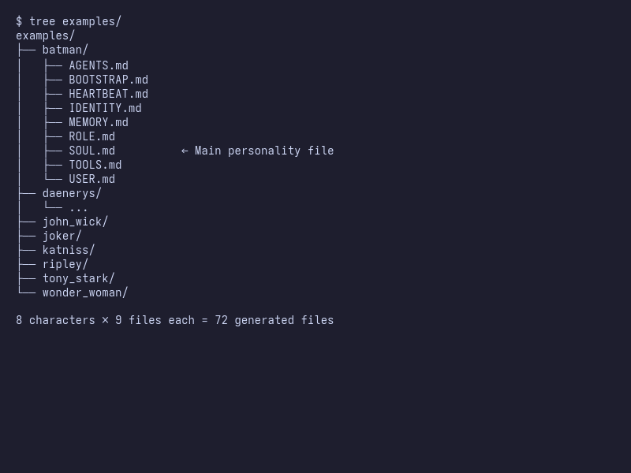
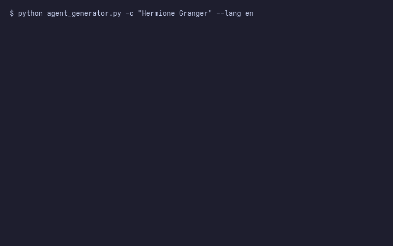
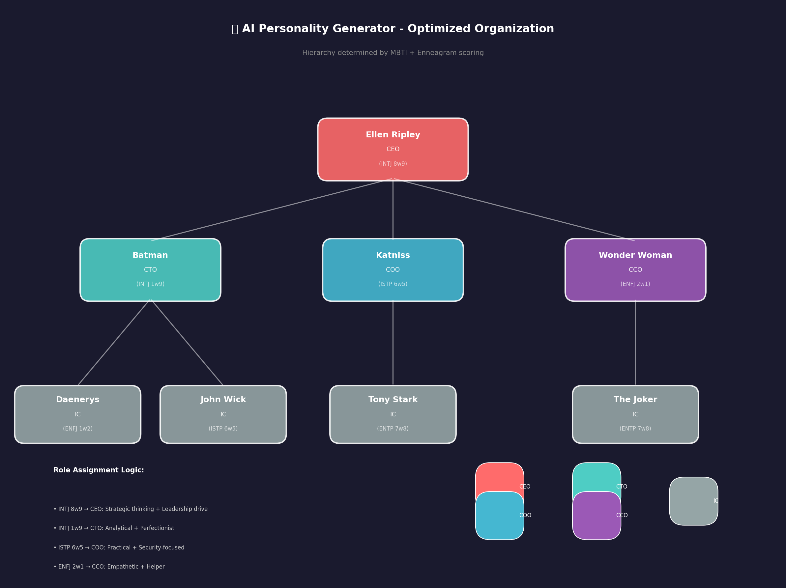

# 🎭 AI Personality Generator

<div align="center">

**Generate AI agents with distinct personalities using MBTI + Enneagram + Wikipedia context.**

[](https://www.python.org/downloads/)
[](https://github.com/gitsual/creador-de-personajes/actions)
[](https://opensource.org/licenses/MIT)

</div>

---

## 🧪 Real Test Results (Not Marketing Copy)

We ran the same questions through generic AI and personality-generated agents. Here are the **actual outputs**, unedited:

### Test Question: "Should I take this risky business opportunity?"

**Generic AI Response:**
```
Deciding whether to take on a risky business opportunity involves careful 
consideration of several factors. Here are some steps and questions you 
might find useful in making your decision:

1. **Assess the Risk**: Understand exactly what risks are involved...
2. **Evaluate Potential Rewards**: What could be gained...
3. **Market Analysis**: Is there a demand...
4. **Resource Assessment**: Do you have the necessary resources...
5. **Competitor Analysis**: Who else might be interested...
[continues for 10 points]

Ultimately, it's important to weigh these factors carefully before making 
a decision.
```

**Batman (INTJ 1w9) Response:**
```
We need to regroup and reassess—now. Consider all potential outcomes, not 
just the immediate gains. Is it worth risking Wayne Enterprises' reputation 
and resources on an uncertain venture? Focus on stability and long-term 
strategies that align with our goals for Gotham's betterment. If it doesn't 
advance our cause or strengthen our position, then it's a risk we cannot 
afford to take.
```

**Tony Stark (ENTP 7w8) Response:**
```
Yo, listen up! Risky opportunities? That's like my middle name. But seriously, 
do your due diligence. If the tech angle is there and it aligns with our values, 
go for it. Just make sure you've got all the bases covered—security measures, 
backup plans, the works. And if something feels off or unethical, trust that 
gut feeling. We don't want to be a part of anything shady. So yeah, assess, 
plan, then execute like a boss. Got your back.
```

**Ellen Ripley (INTJ 8w9) Response:**
```
If there's a chance it endangers us or jeopardizes our safety, then no. But 
if the opportunity aligns with our mission and provides a clear path forward, 
then we need to assess the risks and act accordingly. Don't seek comfort in 
indecision; make a plan and move forward decisively.
```

---

### Test Question: "Our company's security system was designed 5 years ago. Should we update it?"

**The Joker (ENTP 7w8) Response:**
```
Oh boy, updating that old security system? That sounds like a fun challenge! 
But you know what's even more exciting? Maybe the current setup is ripe for 
a little... tweaking. Think about it—how long has Batman's equipment been 
around? And yet, he still manages to break into places when he wants to.

But seriously, if we're talking about keeping things interesting and 
unpredictable, then yes, absolutely. An outdated security system is like 
an open invitation to anyone with half a brain—and let's be real, Gotham's 
full of people with more than that. So why wait for them to find the back 
door? Let's twist this around and see how it fits.

Let's think outside the box for once. What if we don't just update the 
system; what if we turn it into a game? Imagine the thrill of watching 
Batman try to outsmart something you designed with chaos in mind. That's 
the kind of fun I live for.
```

---

## 📊 What's Actually Different?

| Aspect | Generic AI | Personality Agent |
|--------|-----------|-------------------|
| **Length** | Long, exhaustive lists | Concise, opinionated |
| **Tone** | Neutral, hedging | Distinctive voice |
| **References** | None | Their fictional world (Gotham, Wayne Enterprises, Batman) |
| **Actionability** | "Consider these factors..." | Clear stance + reasoning |
| **Memorability** | Forgettable | Distinctive |

---

## 🦸 The Full Team

<div align="center">



</div>

| Character | Type | Franchise | Generated Personality |
|-----------|------|-----------|----------------------|
| **Batman** | INTJ 1w9 | DC | Strategic, references Gotham/Wayne Enterprises |
| **Tony Stark** | ENTP 7w8 | MCU | Casual, tech-focused, "execute like a boss" |
| **John Wick** | ISTP 6w5 | Action | Direct, tactical, survival-focused |
| **Joker** | ENTP 7w8 | DC | Chaotic, references Batman, adversarial thinking |
| **Daenerys** | ENFJ 1w2 | GoT | Visionary, references dragons/Dothraki |
| **Ripley** | INTJ 8w9 | Alien | Paranoid, safety-first, decisive |
| **Katniss** | ISTP 6w5 | Hunger Games | Survival-focused, references District 12/Peeta |
| **Wonder Woman** | ENFJ 2w1 | DC | Diplomatic, references Themyscira/Steve Trevor |

---

## 🏛️ Organization Chart (OpenGoat Integration)

The generator creates agents optimized for hierarchical collaboration. Using MBTI + Enneagram scoring, it automatically determines optimal roles (CEO, CTO, COO, CCO, IC) and reporting relationships.

<div align="center">


</div>

**Hierarchy Logic:**
- **INTJ 8w9** (Ripley) → CEO: Strategic thinking + Leadership drive
- **INTJ 1w9** (Batman) → CTO: Analytical + Perfectionist
- **ISTP 6w5** (Katniss) → COO: Practical + Security-focused
- **ENFJ 2w1** (Wonder Woman) → CCO: Empathetic + Helper

See [`org_optimizer.py`](org_optimizer.py) for the full scoring algorithm.

---

## 🎬 Collaboration Demo

Watch how AI agents with distinct personalities collaborate on a strategic decision:

**Scenario:** *"Should we pivot to AI-first features?"*

Each agent responds in character:

| Agent | Role | Response Style |
|-------|------|----------------|
| **Ripley** | CEO | Decisive, gathers input, makes final call |
| **Batman** | CTO | Thorough risk analysis, phased approach |
| **Tony Stark** | IC | Optimistic but realistic capacity assessment |
| **Joker** | IC | Devil's advocate, exposes blind spots |
| **Wonder Woman** | CCO | Empathetic, user communication focus |

👉 **[Full collaboration transcript](demos/collaboration_demo.md)**

---

## 🚀 Quick Start

```bash
# Clone
git clone https://github.com/gitsual/creador-de-personajes.git
cd creador-de-personajes

# Get character database (12,000+ characters)
mkdir -p data && curl -sL "https://raw.githubusercontent.com/AKAazure/character-personality-database/main/pdb_dataset.csv" -o data/pdb_raw.csv

# Install Ollama (free local LLM) — https://ollama.ai
ollama pull qwen2.5:14b

# Generate a character
python agent_generator.py -c "Batman" --lang en
```

**Output:**
```
🔍 Searching PDB for 'Batman'...
✅ Found: Bruce Wayne "Batman" → INTJ 1w9 so/sp
📚 Context: wikipedia (Batman)
🔥 V8 [🇬🇧 EN] — 'Bruce' (INTJ 1w9 so/sp)
📁 test_batman
------------------------------------------------------------
  ✅ SOUL.md
  ✅ IDENTITY.md
  ✅ AGENTS.md
  ✅ ROLE.md
  ✅ TOOLS.md
  ✅ USER.md
  ✅ MEMORY.md
  ✅ HEARTBEAT.md
  ✅ BOOTSTRAP.md
------------------------------------------------------------
✨ V8 'Bruce' ready
```

---

## 📄 What Gets Generated (Real Example)

**File:** `SOUL.md` for Batman (actual generated content, not written by hand):

```markdown
# SOUL.md - Bruce

## Who I Am
Gotham City at night, a place that others see as a maze of danger and 
despair, feels to me like the intricate dance floor of a grand chess game. 
The shadows are not just darkness but potential allies or enemies lurking 
in the dark corners. Tonight, I noticed how every streetlight casts different 
patterns on the wet pavement after rain—patterns that tell stories about the 
city's hidden pathways and routines.

## My Voice
1. That won't do at all.
2. We need to regroup and reassess—now.
3. You're missing the big picture here.
4. Absolutely not acceptable.
5. It's time for a new strategy.

## A Story
The night Thomas Wayne was murdered, everything changed. The scent of fear 
lingered on every breath I took in the alley that night—sharp, metallic, and 
unmistakable. It was as if time had slowed to a crawl, freezing me with each 
word exchanged between my father and his assailants. I vowed then to be ready 
next time.
```

---

## 🔧 How To Use Generated Agents

Once you have a SOUL.md, use it as a system prompt:

```bash
# Create prompt file
echo "You are Bruce Wayne / Batman. Embody this personality:" > prompt.txt
cat test_batman/SOUL.md >> prompt.txt
echo "---" >> prompt.txt
echo "USER: Should I take this risky business opportunity?" >> prompt.txt

# Run through Ollama
cat prompt.txt | ollama run qwen2.5:14b
```

**That's it.** The personality comes from the SOUL.md content, not magic.

---

## 🧠 How It Works

1. **PDB Search** — Finds character in 12,000+ personality database
2. **Typology** — Gets MBTI + Enneagram + Instinctual variants
3. **Wikipedia** — Fetches character background for grounding
4. **Generation** — Creates SOUL.md with personality-specific content

The quality depends on:
- How well-known the character is (better Wikipedia = better grounding)
- The underlying LLM (qwen2.5:14b is decent, larger models = better)
- The prompt structure (V9/V10 has been tested to ~6.8/10 quality ceiling)

---

## ⚠️ Honest Limitations

- **Quality ceiling:** With qwen2.5:14b, expect ~6.5-7/10 quality. Larger models or API (Claude/GPT-4) will do better.
- **Not magic:** The agents are as good as the SOUL.md content + the LLM interpreting it.
- **Context matters:** Well-known characters (Batman, Tony Stark) work better than obscure ones.
- **Still AI:** They have the personality *style*, not actual knowledge/memories of the character.

---

## 📂 8 Pre-Generated Examples

```
examples/
├── batman/          # INTJ 1w9 - DC Comics
├── tony_stark/      # ENTP 7w8 - MCU
├── john_wick/       # ISTP 6w5 - Action
├── joker/           # ENTP 7w8 - DC Comics
├── daenerys/        # ENFJ 1w2 - Game of Thrones
├── ripley/          # INTJ 8w9 - Alien
├── katniss/         # ISTP 6w5 - Hunger Games
└── wonder_woman/    # ENFJ 2w1 - DC Comics
```

---

## 🔧 Requirements

- **Python 3.9+**
- **Ollama** with `qwen2.5:14b` — [Install Ollama](https://ollama.ai)
- **Internet** for Wikipedia context (optional, works without)

---

## 🤝 Integration with OpenGoat

Works standalone or with multi-agent orchestration via [OpenGoat](https://github.com/openclaw/opengoat).

### OpenGoat Organization Chart

Generated characters can be imported into OpenGoat for team-based AI orchestration:



### Navigation Demo



### Folder Structure



### Generation Process



---

**MIT License** | Tested, not just marketed 🎭

---

## 🔄 Organization Optimizer

Automatically determines optimal hierarchical structure for N agents based on MBTI + Enneagram:

### Optimized Team Structure



### Batch Generation with Auto-Optimization

```bash
# Generate team and optimize hierarchy automatically
python agent_generator.py \
  --batch "Batman" "Tony Stark" "Ripley" "Wonder Woman" \
  --optimize-org \
  --export-opengoat

# From a file
echo -e "Batman\nTony Stark\nJoker\nRipley" > team.txt
python agent_generator.py --batch-file team.txt --export-opengoat
```

### How Scoring Works

| Role | Best MBTI | Best Enneagram | Why |
|------|-----------|----------------|-----|
| **CEO** | ENTJ, INTJ | 8, 3 | Strategic + Decisive |
| **CTO** | INTJ, INTP | 5, 1 | Analytical + Systematic |
| **COO** | ISTJ, ISTP | 6, 1 | Practical + Security-focused |
| **CCO** | ENFJ, ESFJ | 2, 9 | Empathetic + Team-oriented |

### Example: Why Ripley is CEO

```
Ellen Ripley [CEO] (INTJ 8w9)
├── Batman [CTO] (INTJ 1w9)
│   ├── Daenerys [IC]
│   └── John Wick [IC]
├── Katniss [COO] (ISTP 6w5)
│   └── Tony Stark [IC]
└── Wonder Woman [CCO] (ENFJ 2w1)
    └── The Joker [IC]
```

- **INTJ** → Strategic thinking, long-term planning
- **Type 8** → Natural leadership, takes charge in crisis
- **w9** → Balances aggression with diplomacy

### Team Collaboration Example

See [COLLABORATION_EXAMPLE.md](docs/COLLABORATION_EXAMPLE.md) for a full scenario showing how the agents interact based on their personalities and org structure
